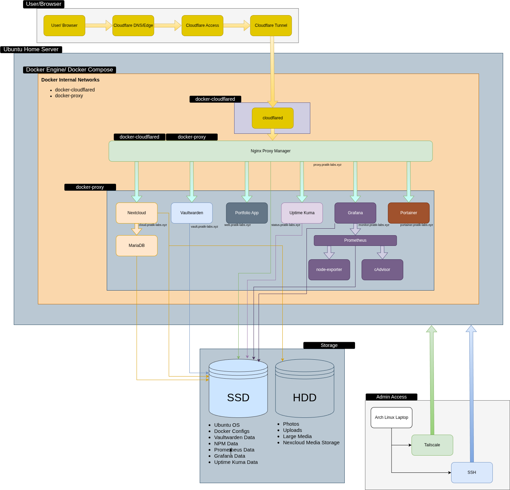

# 🏠 Private Cloud Infrastructure

A self-hosted private cloud and homelab infrastructure project focused on secure remote access, containerized service deployment, reverse-proxy-based ingress, and observability.

## Architecture Diagram



---

## 🧠 Overview

This project documents a self-hosted private cloud infrastructure built to practice real-world DevOps concepts, including secure ingress, containerized service deployment, reverse proxy routing, and observability in a production-like environment.

The stack is centered around Docker Compose, Cloudflare Tunnel, and a reverse-proxy-based architecture for secure and controlled service access.

The environment is designed with **no public application ports exposed**, where Cloudflare handles the public edge while internal services remain isolated behind Docker networks and reverse proxy routing.

---

## 🖥️ Hardware & Environment

- **Host:** Custom Home Server
- **CPU:** Intel i7-4770
- **RAM:** 16GB DDR3
- **System Drive:** 128GB SSD
- **Data Drive:** 1TB HDD
- **OS:** Ubuntu Server 24.04 LTS
- **Admin Workstation:** Arch Linux Laptop

---

## 🏗️ Core Architecture

### Ingress & Access
- **Domain:** `pratik-labs.xyz`
- **DNS / Edge:** Cloudflare
- **Public Ingress:** Cloudflare Tunnel (`cloudflared`)
- **Identity Layer:** Cloudflare Access
- **Reverse Proxy:** Nginx Proxy Manager

### Container Platform
- **Container Runtime:** Docker Engine
- **Orchestration:** Docker Compose
- **Networking:** Internal Docker networks with service discovery via DNS

### Private Administration
- **Remote Access:** Tailscale + SSH
- **File Access:** SFTP over SSH

---

## 🌐 Network Design

The infrastructure follows a **private-by-default architecture**:

- No public application ports exposed
- All ingress handled via outbound-only Cloudflare Tunnel
- Internal communication via Docker networks and service names
- Administrative access restricted via SSH and private networking (Tailscale)

### Docker Networks
- **`docker-cloudflared`** -> ingress handoff network
- **`docker-proxy`** -> internal service communication

---

## 📦 Deployed Services

| Service | Description |
|--------|------------|
| **Cloudflare Tunnel** | Secure ingress without exposing ports |
| **Nginx Proxy Manager** | Reverse proxy and routing |
| **Nextcloud** | Self-hosted storage with hybrid SSD + HDD design |
| **MariaDB** | Database backend for Nextcloud |
| **Vaultwarden** | Self-hosted password manager |
| **Portfolio Application** | Containerized app deployed from separate repo |
| **Uptime Kuma** | Service uptime monitoring |
| **Prometheus** | Metrics collection |
| **Grafana** | Metrics visualization |
| **Node Exporter** | Host-level metrics |
| **cAdvisor** | Container-level metrics |
| **Gotify** | Uptime Alert |

---

## 💾 Storage Design

A hybrid storage model balances performance and capacity:

### SSD Tier
- OS
- Docker data
- Databases
- Application state

### HDD Tier
- Media storage
- Large file storage (`/mnt/storage`)

### Strategy
Latency-sensitive workloads remain on SSD, while large data is offloaded to HDD.
Nextcloud uses both tiers for optimal performance and capacity.

---

## 🔐 Security Model

Security is a core design principle:

- No public application ports exposed
- Cloudflare Tunnel for ingress
- Cloudflare Access for identity-based protection
- UFW firewall with default deny
- SSH key-based authentication
- Secrets managed via `.env` (not stored in Git)
- Container isolation through Docker networking

---

## 🚀 Deployment Automation

This infrastructure integrates with a **pull-based deployment model**:

- Docker images are built via GitHub Actions
- Images are published to GitHub Container Registry (GHCR)
- A scheduled Bash script on the server checks for updates
- Services are updated automatically using Docker Compose

### Why Pull-Based?

- No inbound deployment access required
- Server remains private
- Secure and controlled updates
- Mirrors real-world internal deployment patterns

---

## 🔧 Infrastructure Automation (Ansible)

To improve consistency and reduce manual configuration, Ansible is used to automate infrastructure synchronization and service deployment.

### Structure

- `infra-sync.yml` -> Synchronizes Docker configurations and scripts to the server
- `deploy-all.yml` -> Validates and deploys all services
- `deploy-service.yml` -> Contains the shared service deployment with `deploy-all.yml`

### Deployment Flow

1. Infrastructure files are synced to the server
2. Service configurations are validated (directory, compose file, environment variables)
3. Containers are updated using Docker Compose

### Tag-Based Deployment

Services share a single deployment procedure (`deploy-service.yml`) imported by `deploy-all.yml` once per service. Each service is tagged with its name, so a single service can be deployed without running the whole stack:

```bash
ansible-playbook -i inventory.ini deploy-all.yml --tags monitoring
```

### Key Features

- Validation-first deployment (fails early if configuration is missing)
- Modular playbooks for individual services
- Scalable multi-service deployment using loops
- Separation between configuration sync and deployment

### Example Usage

Deploy all services:

```bash
ansible-playbook -i inventory.ini deploy-all.yml
```

Deploy a single service:
```bash
ansible-playbook -i inventory.ini individual/deploy-portfolio.yml
```

---

## 📁 Repository Structure

```text
.
├── ansible
│   ├── deploy-all.yml
│   ├── deploy-service.yml
│   ├── infra-sync.yml
│   ├── inventory.ini
│   ├── inventory.ini.example
│   └── setup.yml
├── docker
│   ├── cloudflared
│   │   └── docker-compose.yml
│   ├── gotify
│   │   └── docker-compose.yml
│   ├── monitoring
│   │   ├── docker-compose.yml
│   │   └── prometheus
│   │       └── prometheus.yml
│   ├── nextcloud
│   │   └── docker-compose.yml
│   ├── nginx-proxy-manager
│   │   └── docker-compose.yml
│   ├── portfolio
│   │   └── docker-compose.yml
│   ├── uptime-kuma
│   │   └── docker-compose.yml
│   └── vaultwarden
│       └── docker-compose.yml
├── docs
│   ├── architecture
│   │   ├── architecture.drawio
│   │   └── architecture.png
│   └── guides
│       ├── ansible-automation.md
│       ├── ci-cd.md
│       ├── decisions.md
│       ├── networking.md
│       └── services.md
├── README.md
├── screenshots
│   ├── 01-docker-ps.png
│   ├── 02-docker-networks.png
│   ├── 03-portainer.png
│   ├── 04-nginx-proxy.png
│   ├── 05-grafana-node-exporter.png
│   ├── 06-grafana-cadvisor.png
│   ├── 07-uptime-kuma.png
│   ├── 08-cloudflare-dns.png
│   ├── 09-cloudflare-access-policy.png
│   └── 10-cloudflare-access-applications.png
└── scripts
    └── update-portfolio.sh


```

---

## 📌 Notes
This repository contains infrastructure configuration and documentation only. 
The portfolio application source code is maintained separately: [Portfolio Repository](https://github.com/pratikbhattarai76/portfolio-application-deployment)
